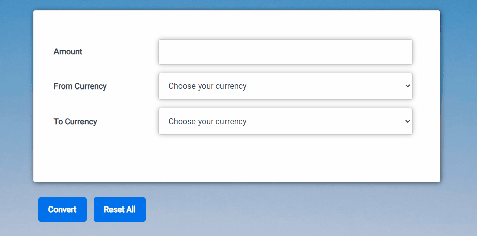

# Currency Converter
Basic application, where you can enter the volume and select required currency pair. You can choose between four currencies: GBP, EUR, USD, PLN. 

## Demo
[Currency Converter](https://pobacz.github.io/currency-converter/)

## To use application, follow these steps 
1. Enter the amount
2. Select the base currency
3. Select the target currency
4. Press **Convert** button to see the conversion
5. Press **Reset All** to start fresh

## Screenshoot


## Technologies
- HTML
- CSS
- JAVASCRIPT ES6
- BEM

## Code sample
```javascript
  const computeFinalOutcome = (toCurrency, computePrimaryOutcome) => {
        switch (toCurrency) {

            case "GBP":
                return computePrimaryOutcome / pound;

            case "USD":
                return computePrimaryOutcome / dollar;

            case "EUR":
                return computePrimaryOutcome / euro;

            case "PLN":
                return computePrimaryOutcome / zloty;
        }
    }
```

## Status
Project is in progress

## Contact
If you want to contact me, you can reach me at paobacz@gmail.com
